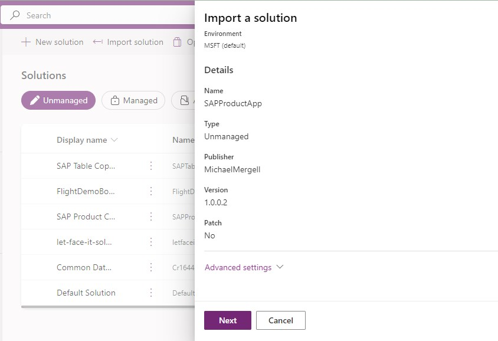
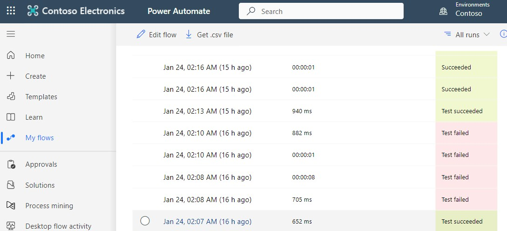

# Power Canvas Apps for SAP Data Integration

## Overview

This repository contains a Power Apps canvas app designed to facilitate seamless access to SAP data for mobile workers. The app provides an intuitive interface for personnel on manufacturing sites, warehouses, shops, and other on-the-go environments to interact with critical business data directly from their mobile devices. 

## Features

- **SAP Connectivity**: Leverage direct OData connections to fetch and update data in your SAP system.
- **Mobile-Optimized Design**: Crafted specifically for mobile usage, ensuring ease of use on any device.
- **SAP Data Access**: Enable workers to retrieve and update information from SAP while in the field.

## Feature outlook

- **Offline Capabilities**: The current iteration of the app requires network connectivity for data updates. "update later" functionality can be added depending on customer requirements. 
- **Single Sign On**: Single Sign-On integration is planned for subsequent updates as the SAP OData connector matures out of the preview phase. 

## Use Cases

- **Manufacturing**: Shop floor workers can quickly report production incidents, check task lists, and update progress.
- **Warehouse Management**: Staff can manage inventory, process orders, and scan barcodes to update stock levels.
- **Retail**: Enables retail employees to access product information, check inventory, and process sales orders.

## User Interface

## Architecture

## Prerequesites

1. Power Platform Access
    - Power Virtual Agent (PVA), to create the copilot https://web.powerva.microsoft.com/
    - Power Automate Flows: https://make.powerautomate.com/
    - Recommended for productive use is separated DEV and PROD environments
    - Trial license: https://learn.microsoft.com/en-us/power-apps/maker/signup-for-powerapps
1. SAP System
    - For learning and demo purpose you can use the SAP Gateway Demo System ES5
    - Signup here: https://developers.sap.com/tutorials/gateway-demo-signup.html
    - Allthough this works somehow, there are often connection errors.

# Setup

Follow the setup instructions to connect the app with your SAP instance. Customize the app further to meet your unique business needs and deploy it to your team for improved productivity and data accuracy.

## Import the Solution

This step will import the required components into your environment. Make sure you are connected to your Non-PROD environment.

- Download the solution as zip file: [Download the Solution](https://github.com/mimergel/SAP_Product_App/raw/main/solution/SAPProductApp_1_0_0_3.zip).

- Login to https://make.powerapps.com/ 
- Go to Solutions.
- Choose "Import solution":

      

- Browse files and select the downloaded SAPProductApp_[version number].zip:

      

- During the subsequent steps you'll need to update the SAP OData connection references:

      

      

- Create the required SAP Odata Connection:

    Values for SAP ES5 Demo System are:
    - OData Base URI: https://sapes5.sapdevcenter.com/sap/opu/odata/iwbep/GWSAMPLE_BASIC
    - Username e.g.: S001234567 (use your person S-user for the ES5 system. Note: it's not the SAP support user ID)
    - Password: xxxxxxxxxx (Note: during preview only basic authentication is available)

      

 - Now after refreshing and entering the ODATA connection reference you can proceed to import the solution.

## Test the App

- Login to https://make.powerapps.com/ 
- Find the app under "Your apps"

      

- Start the app by clicking on the list entry
- Then execute "preview the app (F5)"

      

- The first step is to refresh the data from SAP

      

- Now you can browse and search the product entries

      

- Try to edit a product, delete and add a new product. Note: adding images is not implemented.

## Troubleshooting

- In case of errors most likely the primary or the child flow failed.  
    - Check here: https://make.powerautomate.com/ in  
        - "My Flows"    
        - "28-days run history"   
- The logs of the flow run provide helpful error messages.   

      

- In this case the flow failed when testing different syntax for a filter expression. 

      

  

Most common observed errors have been with unavailabilty of the ES5 system.

## Contributing

Contributions to enhance the capabilities are welcome.

## License

This project is licensed under the MIT License.

## Disclaimer

THE CONTENT OF THIS REPOSITORY IS PROVIDED AS IS WITHOUT WARRANTY OF ANY KIND, EITHER EXPRESS OR IMPLIED, INCLUDING ANY IMPLIED WARRANTIES OF FITNESS FOR A PARTICULAR PURPOSE, MERCHANTABILITY, OR NON-INFRINGEMENT.